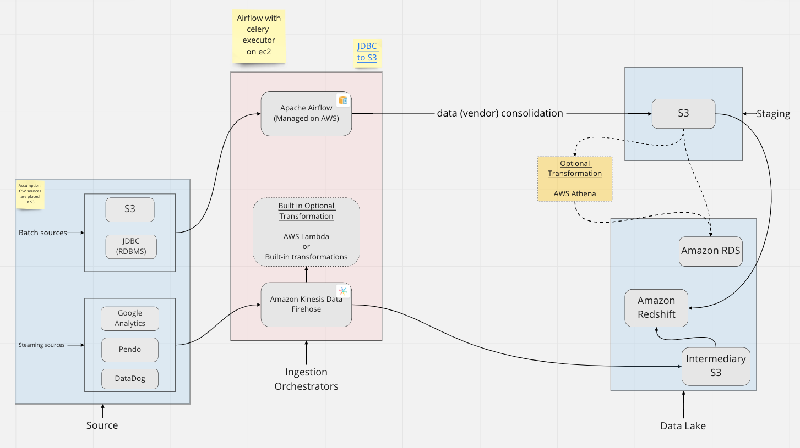

# ETL for migration to AWS

I worked on a consultation for `firm-that-cannot-be-named`. This ETL implementation deals with their use-case of migrating
their DB systems to AWS and also consolidating them while the system was up. 

## Premise:
Migrate data from a set of databases for different `tenants`, having the same DB schema (awful design to begin with? 
tell me about it) and operations to AWS under one database with changes in schema, dealing with live data while the 
systems are still under use. 

I was tasked with creating an ELT/ ETL pipeline for the above system which was being deployed in a microservice 
architecture, the existing system was also integrated with DataDog, Pendo and Google Analytics and in order to better 
understand the data we needed to combine all these sources at one place. 

While designing the system following are the points to be considered: 
1. Should be able to extract data from multiple sources i.e. S3, Google Analytics, RDBMS, CSV etc. 
2. Should be able to extract a few million rows in a day. 
3. Should be able to extract data in batch or stream mode. (Ideally both) 
4. Extraction strategy to keep track of what data has been updated, hence needs to be processed. 
5. Should be able to run multiple pipelines if needed. 
6. Data warehouse choice. (Preferably the very popular AWS Redshift)
7. 99.9% availability. 
8. Scalable in terms of storage, compute and memory if needed 
9. Should be able to keep track of pipeline progress. 
10. Failover strategy if pipelines fail in the middle.

## Assumptions:
* The premise outlined in the case study provides information that we have multiple sources to extract from, including CSV files. I have assumed that all such sources are placed in an S3 bucket.
* Since the premise lacks information on whether we would like to perform any transformations during our process or not, I assume that the ability to perform transformations is “nice to have” rather than “necessary”. Nonetheless, the system will provide hooks for any transformations needed.

## Architecture

 

    

The architecture is fully managed in the AWS cloud environment. It consists of two separate pipelines. One to deal with 
analytics data from Pendo, DataDog and Google Analytics, which are categorized as streaming sources. The second deals 
with S3, CSV, JDBC (RDBMS) as batch sources. Both of these pipelines take a different path, dealing in their own way 
with their respective kinds of data. The choice of data warehouse here is Amazon Redshift for analytical data. However, 
for the case of transactional data (vendor data, order records, inventory, stock etc), I suggest not the use of a 
warehouse, but an Amazon RDS server instead. Amazon RDS is configured for OLTP use-cases, while Amazon redshift is a
columnar database and suited for analytical queries rather than transactional queries. 

[Interesting example of the wrong use of AWS Redshift](https://www.integrate.io/blog/dont-use-redshift-as-an-oltp-database/)

### 1- Batch pipeline
It has [Apache Airflow managed on AWS](https://docs.aws.amazon.com/mwaa/latest/userguide/what-is-mwaa.html) at the core of the workflow. Apache Airflow conducts workflow orchestration and keeps track of failed tasks and gives the ability to re-run them. Apache airflow has a variety of Operators that help it hook into different services to achieve this task.
* **Extract**
    * [SQLToS3Operator](https://airflow.apache.org/docs/apache-airflow-providers-amazon/stable/operators/transfer/sql_to_s3.html#sql-to-amazon-s3) to help get data from different RDBMS into S3, where the data is consolidated from different vendors into a single bucket, managed in separate directories according to their vendors
    * [Custom operator](https://airflow.apache.org/docs/apache-airflow-providers-common-sql/stable/_api/airflow/providers/common/sql/hooks/sql/index.html#module-airflow.providers.common.sql.hooks.sql) to copy data from S3 in staging tables, adding references to identify vendor, into Amazon RDS
* **Transform**
    * [Custom operator](https://airflow.apache.org/docs/apache-airflow-providers-common-sql/stable/_api/airflow/providers/common/sql/hooks/sql/index.html#module-airflow.providers.common.sql.hooks.sql) to perform any transformations/cleaning on staging data
* **Load**
    * [Custom operator](https://airflow.apache.org/docs/apache-airflow-providers-common-sql/stable/_api/airflow/providers/common/sql/hooks/sql/index.html#module-airflow.providers.common.sql.hooks.sql) to copy into production tables when ready
* **Monitoring and fallback**
    * Airflow comes with out-of-the-box reporting/alerts on failed tasks, a good interface for error reporting and the option to automate rerunning of failed tasks

### 2- Streaming pipeline
The streaming Pipeline has Amazon Kinesis at the core, dealing with streaming data, providing hooks for any transformations needed, and feeding it into Amazon Redshift all on its own.

Amazon Kinesis works by catching streaming data, passing it through lambda functions/custom transformations/out-of-the-box transformation options, and then feeding it into an intermediary S3 location from where it is copied into Amazon Redshift automatically. We can choose to keep S3 data indefinitely in case we plan to do a schema-on-read type analysis on the data, otherwise we can configure to clean it up on intervals (quarterly?).

* **Extract**
    * Kinesis Data Streams to convert data source into stream, in case a bridging mechanism is needed between source and Kinesis Firehose. This step is optional and depends on implementation. Else Kinesis Firehose may directly hook up to source
* **Transform**
    * Kinesis Firehose to capture data stream, process it via user specified transformations if needed
* **Load**
    * Kinesis Firehose first loads data into an intermediary S3, and then loads data into Amazon Redshift
* **Monitoring and fallback**
    * Kinesis can be configured with [Amazon Cloudwatch](https://aws.amazon.com/cloudwatch/) which provides real-time logs and monitoring according to user specified key metrics which allows us to monitor the pipeline and its progress. For fallback options, we can configure it to work with transactions and commit ever so often to production instead of on every instance of data. So, in case of failure, we can roll back to the previous working state and move on from there.

### 3- Approach
There are multiple methods when migrating data between systems. The best approach is the [blue-green system](https://martinfowler.com/bliki/BlueGreenDeployment.html).
It gives us no downtime while allowing us to have a perfect rollback option in case of failure of the new system.
I proposed we build our new (green) system in parallel to our old (blue) system via our ETL process. When the green 
system is built, tested robustly and rigorously, then we shift from our blue system to our green system, keeping the 
blue system online for a long enough time to prove the viability of the green system and then move ahead to shut down 
the blue system.

### 4- Change data Capture (CDC):
The process of ETL would be much simpler if we had a static system, but in real world scenarios that is almost never the
case. To deal with this, we have the concept of CDC. CDC techniques range from application level to database level to 3rd party solutions. Each has its pros and cons. For our use case, I suggest we use trigger-based CDCs or audit columns.

1. Trigger based CDC allows us to hook up triggers in our database, which performs an action on any change in data. We can simply implement a shadow table that keeps record of only the row numbers that have changed since the last time our database partition was extracted. And it can signal to our workflow orchestrator (Airflow) exactly which rows have been updated and need to be processed again via the pipeline.
* Pros:
    * No data inconsistencies produced
    * Database level, native solution without any 3rd party reliance
* Cons:
    * Added workload on DB, reduced performance due to extra steps on every update

2. Audit columns such as creation_date or last_modified help us determine change in data. For example: if data collection happened at “1 OCT 2022 12:30:59”, then any columns that have a last modified date greater than this timestamp at the time of the next batch extraction will again be included in the batch process and processed through the pipeline.
* Pros:
    * It can be included at database level
    * No need for 3rd party tools
    * Does not have adverse effects on performance
* Cons:
    * Adds the additional overhead of adding extra columns to all tables (which is not the worst overhead to have in such a use case)
    
----